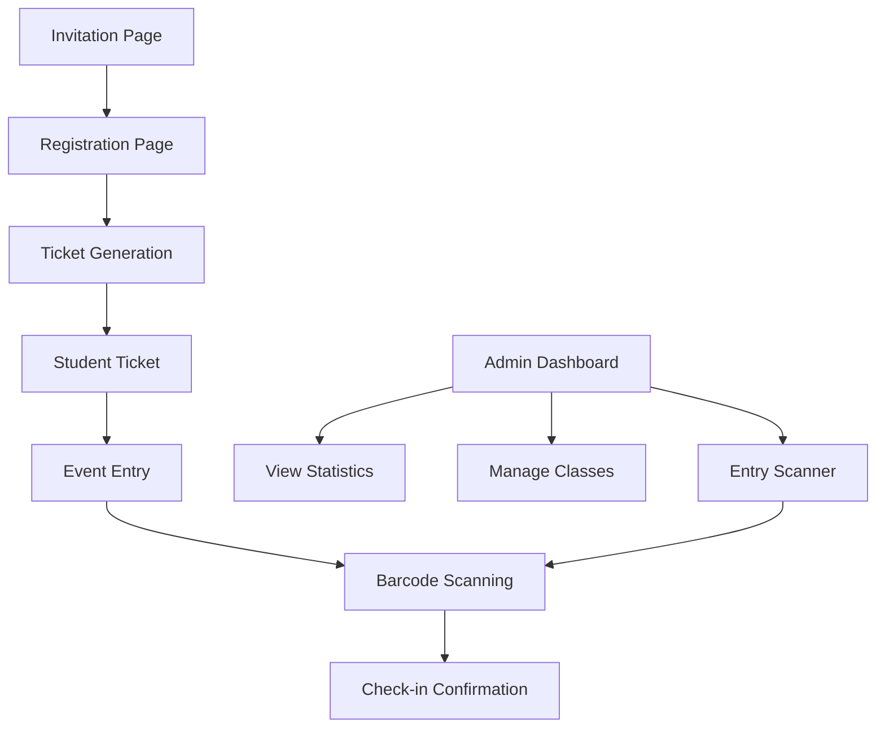

## 1. Product Overview
A luxury digital invitation and event management system for matric farewell celebrations. The app provides elegant digital invitations, seamless registration, automated ticket generation, and comprehensive attendance tracking for an unforgettable premium experience.

Target users: Matric students, teachers, and event administrators seeking a sophisticated digital solution for their farewell celebration.

## 2. Core Features

### 2.1 User Roles
| Role | Registration Method | Core Permissions |
|------|---------------------|------------------|
| Student | Self-registration with school email | View invitation, register attendance, download ticket |
| Teacher | Pre-registered by admin | View class attendance, manage student registrations |
| Admin | System administrator | Full access to dashboard, statistics, entry management |

### 2.2 Feature Module
The matric farewell invitation app consists of the following main pages:
1. **Invitation Card Page**: Luxury digital invitation with school branding, event details, and registration button.
2. **Registration Page**: Student information form with name, class, form teacher selection.
3. **Ticket Page**: Generated ticket with barcode, student details, and entry instructions.
4. **Admin Dashboard**: Attendance statistics, class breakdowns, and management tools.
5. **Entry Scanner**: Barcode scanning interface for checking students in at the event.

### 2.3 Page Details
| Page Name | Module Name | Feature description |
|-----------|-------------|---------------------|
| Invitation Card | Hero Section | Display luxury invitation with navy blue background, gold accents, animated school logo, event date/time/venue details. |
| Invitation Card | Registration Button | Prominent gold button linking to registration form with hover effects. |
| Registration | Student Form | Collect student name, surname, student ID, class selection (Grade 12A-12H), form teacher dropdown. |
| Registration | Validation | Real-time form validation, duplicate registration prevention, school email verification. |
| Ticket Generation | Digital Ticket | Auto-generate personalized ticket with student details, unique barcode, event information. |
| Ticket Generation | Download/Share | Download ticket as PDF, share via email/WhatsApp, add to digital wallet. |
| Admin Dashboard | Statistics Overview | Total registrations, attendance rate, class-wise breakdown charts. |
| Admin Dashboard | Class Management | View students by class, export attendance reports, send reminders. |
| Entry Scanner | Barcode Scanner | Camera-based barcode scanning, manual ID entry fallback, instant check-in confirmation. |
| Entry Scanner | Real-time Updates | Live attendance counter, recently checked-in students display. |

## 3. Core Process

### Student Flow
Students receive invitation link → View luxury invitation → Click register → Fill form → Receive ticket → Attend event → Get scanned in

### Admin Flow
Admin accesses dashboard → Views registration statistics → Monitors class attendance → Exports reports → Manages entry scanning

## 4. User Interface Design

### 4.1 Design Style
- **Primary Colors**: Navy Blue (#1a237e), Gold (#ffd700), White (#ffffff)
- **Accent Colors**: Deep Navy (#0d47a1), Light Gold (#ffecb3)
- **Button Style**: Rounded corners with gold gradient, subtle shadow effects
- **Typography**: Elegant serif fonts for headings (Playfair Display), clean sans-serif for body (Montserrat)
- **Layout**: Card-based design with generous spacing, luxury magazine-inspired
- **Icons**: Minimalist line icons with gold accents, school crest integration
- **Animations**: Smooth fade-ins, parallax scrolling, subtle hover effects

### 4.2 Page Design Overview
| Page Name | Module Name | UI Elements |
|-----------|-------------|-------------|
| Invitation Card | Hero Section | Full-screen navy background with animated gold particles, centered school logo (150px), elegant typography with gold highlights, responsive design. |
| Registration | Form Container | White card with gold border (2px), navy headers, gold input focus states, prominent gold submit button with ripple effect. |
| Ticket Page | Digital Ticket | iPhone mockup displaying ticket, navy header with gold text, white content area, unique barcode at bottom, share buttons with gold icons. |
| Admin Dashboard | Statistics Cards | Navy cards with gold numbers, interactive charts with gold accents, data tables with alternating row colors. |
| Entry Scanner | Scanner Interface | Full-camera view with overlay guides, navy header bar, gold scan button, manual entry option as backup. |

### 4.3 Responsiveness
- **Mobile-First Design**: Optimized for smartphones as primary device
- **Tablet Adaptation**: Enhanced layouts for iPad/tablet viewing
- **Desktop Experience**: Luxury full-screen experience for administrators
- **Touch Optimization**: Large touch targets, swipe gestures for navigation
- **Loading States**: Elegant skeleton screens with gold shimmer effects