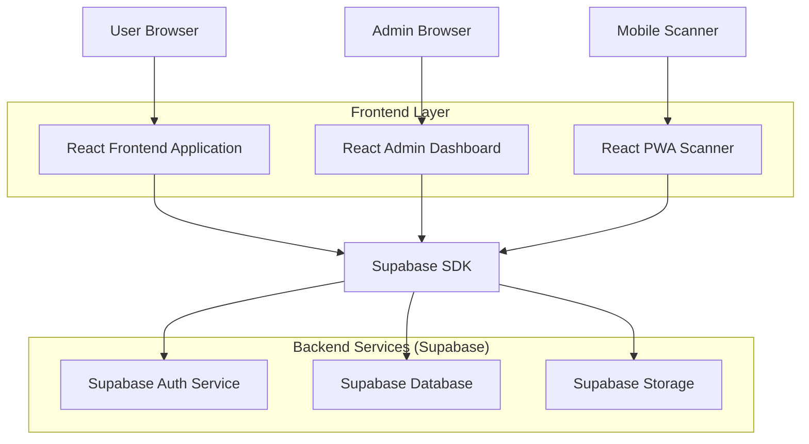
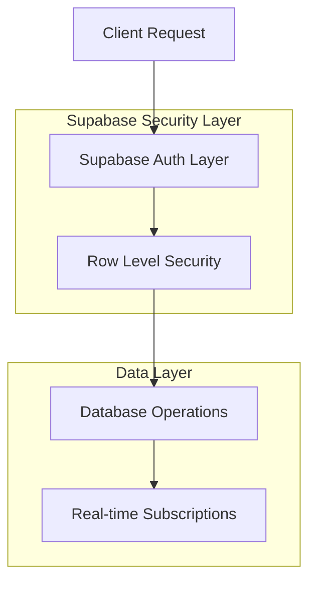

## 1. Architecture Design



## 2. Technology Description

- **Frontend**: React@18 + Vite + Tailwind CSS@3 + Framer Motion
- **Backend**: Supabase (PostgreSQL, Auth, Storage, Real-time)
- **State Management**: React Context + Supabase Real-time
- **UI Components**: Custom luxury components with Tailwind
- **Barcode Generation**: JsBarcode library
- **PDF Generation**: jsPDF + html2canvas
- **Camera Integration**: react-qr-reader for barcode scanning

## 3. Route Definitions

| Route | Purpose |
|-------|---------|
| / | Luxury invitation landing page |
| /register | Student registration form |
| /ticket/:id | Personal ticket with barcode |
| /admin | Admin dashboard with statistics |
| /admin/scanner | Barcode scanning interface |
| /admin/classes | Class management and reports |
| /login | Admin authentication |

## 4. API Definitions

### 4.1 Authentication APIs

```
POST /auth/v1/token
```

Request:
| Param Name | Param Type | isRequired | Description |
|------------|------------|-------------|-------------|
| email | string | true | Admin email address |
| password | string | true | Admin password |

### 4.2 Student Registration APIs

```
POST /rest/v1/students
```

Request:
| Param Name | Param Type | isRequired | Description |
|------------|------------|-------------|-------------|
| name | string | true | Student full name |
| student_id | string | true | Unique student ID |
| class | string | true | Class designation (12A-12H) |
| form_teacher | string | true | Form teacher name |
| email | string | true | Student school email |

### 4.3 Ticket Generation APIs

```
GET /rest/v1/tickets?student_id=eq.{id}
```

Response:
| Param Name | Param Type | Description |
|------------|-------------|-------------|
| ticket_id | uuid | Unique ticket identifier |
| barcode | string | Generated barcode number |
| student_data | json | Student information |
| created_at | timestamp | Ticket generation time |

### 4.4 Attendance APIs

```
PATCH /rest/v1/students?id=eq.{id}
```

Request:
| Param Name | Param Type | isRequired | Description |
|------------|------------|-------------|-------------|
| attended | boolean | true | Attendance status |
| check_in_time | timestamp | false | Time of check-in |

## 5. Server Architecture Diagram



## 6. Data Model

### 6.1 Database Schema

```mermaid
erDiagram
  STUDENT ||--o{ TICKET : has
  STUDENT ||--o{ ATTENDANCE : has
  CLASS ||--o{ STUDENT : contains
  TEACHER ||--o{ CLASS : teaches
  
  STUDENT {
    uuid id PK
    string student_id UK
    string name
    string email UK
    string class_id FK
    boolean registered
    boolean attended
    timestamp check_in_time
    timestamp created_at
  }
  
  TICKET {
    uuid id PK
    uuid student_id FK
    string barcode UK
    json ticket_data
    boolean is_used
    timestamp created_at
  }
  
  CLASS {
    uuid id PK
    string name UK
    string grade
    uuid form_teacher_id FK
    integer total_students
  }
  
  TEACHER {
    uuid id PK
    string name
    string email UK
    string employee_id
    boolean is_active
  }
  
  ATTENDANCE {
    uuid id PK
    uuid student_id FK
    timestamp check_in_time
    string check_in_method
    uuid scanned_by FK
  }
```

### 6.2 Data Definition Language

**Students Table**
```sql
CREATE TABLE students (
  id UUID PRIMARY KEY DEFAULT gen_random_uuid(),
  student_id VARCHAR(20) UNIQUE NOT NULL,
  name VARCHAR(100) NOT NULL,
  email VARCHAR(255) UNIQUE NOT NULL,
  class_id UUID REFERENCES classes(id),
  registered BOOLEAN DEFAULT false,
  attended BOOLEAN DEFAULT false,
  check_in_time TIMESTAMP WITH TIME ZONE,
  created_at TIMESTAMP WITH TIME ZONE DEFAULT NOW(),
  updated_at TIMESTAMP WITH TIME ZONE DEFAULT NOW()
);

CREATE INDEX idx_students_student_id ON students(student_id);
CREATE INDEX idx_students_class ON students(class_id);
CREATE INDEX idx_students_attended ON students(attended);
```

**Tickets Table**
```sql
CREATE TABLE tickets (
  id UUID PRIMARY KEY DEFAULT gen_random_uuid(),
  student_id UUID REFERENCES students(id) ON DELETE CASCADE,
  barcode VARCHAR(50) UNIQUE NOT NULL,
  ticket_data JSONB NOT NULL,
  is_used BOOLEAN DEFAULT false,
  created_at TIMESTAMP WITH TIME ZONE DEFAULT NOW()
);

CREATE INDEX idx_tickets_barcode ON tickets(barcode);
CREATE INDEX idx_tickets_student ON tickets(student_id);
```

**Classes Table**
```sql
CREATE TABLE classes (
  id UUID PRIMARY KEY DEFAULT gen_random_uuid(),
  name VARCHAR(10) UNIQUE NOT NULL,
  grade VARCHAR(10) NOT NULL,
  form_teacher_id UUID REFERENCES teachers(id),
  total_students INTEGER DEFAULT 0,
  created_at TIMESTAMP WITH TIME ZONE DEFAULT NOW()
);
```

**Teachers Table**
```sql
CREATE TABLE teachers (
  id UUID PRIMARY KEY DEFAULT gen_random_uuid(),
  name VARCHAR(100) NOT NULL,
  email VARCHAR(255) UNIQUE NOT NULL,
  employee_id VARCHAR(20) UNIQUE NOT NULL,
  is_active BOOLEAN DEFAULT true,
  created_at TIMESTAMP WITH TIME ZONE DEFAULT NOW()
);
```

**Attendance Table**
```sql
CREATE TABLE attendance (
  id UUID PRIMARY KEY DEFAULT gen_random_uuid(),
  student_id UUID REFERENCES students(id) ON DELETE CASCADE,
  check_in_time TIMESTAMP WITH TIME ZONE DEFAULT NOW(),
  check_in_method VARCHAR(20) DEFAULT 'barcode',
  scanned_by UUID REFERENCES auth.users(id),
  created_at TIMESTAMP WITH TIME ZONE DEFAULT NOW()
);

CREATE INDEX idx_attendance_student ON attendance(student_id);
CREATE INDEX idx_attendance_time ON attendance(check_in_time);
```

### 6.3 Row Level Security Policies

```sql
-- Students table policies
ALTER TABLE students ENABLE ROW LEVEL SECURITY;

-- Allow anonymous users to register
CREATE POLICY "Allow registration" ON students FOR INSERT TO anon
WITH CHECK (true);

-- Allow students to view their own data
CREATE POLICY "Students view own data" ON students FOR SELECT TO authenticated
USING (auth.uid() = id);

-- Allow admins full access
CREATE POLICY "Admin full access" ON students FOR ALL TO authenticated
USING (auth.jwt() ->> 'role' = 'admin');

-- Tickets table policies
ALTER TABLE tickets ENABLE ROW LEVEL SECURITY;

CREATE POLICY "Students view own tickets" ON tickets FOR SELECT TO authenticated
USING (auth.uid() = student_id);

CREATE POLICY "Admin manage tickets" ON tickets FOR ALL TO authenticated
USING (auth.jwt() ->> 'role' = 'admin');
```

### 6.4 Initial Data Setup

```sql
-- Insert sample classes
INSERT INTO classes (name, grade, total_students) VALUES
('12A', 'Grade 12', 0),
('12B', 'Grade 12', 0),
('12C', 'Grade 12', 0),
('12D', 'Grade 12', 0),
('12E', 'Grade 12', 0),
('12F', 'Grade 12', 0),
('12G', 'Grade 12', 0),
('12H', 'Grade 12', 0);

-- Insert sample teachers
INSERT INTO teachers (name, email, employee_id) VALUES
('Mrs. Smith', 'smith@school.edu', 'T001'),
('Mr. Johnson', 'johnson@school.edu', 'T002'),
('Ms. Williams', 'williams@school.edu', 'T003'),
('Mr. Brown', 'brown@school.edu', 'T004');

-- Update classes with form teachers
UPDATE classes SET form_teacher_id = (SELECT id FROM teachers WHERE email = 'smith@school.edu') WHERE name = '12A';
UPDATE classes SET form_teacher_id = (SELECT id FROM teachers WHERE email = 'johnson@school.edu') WHERE name = '12B';
UPDATE classes SET form_teacher_id = (SELECT id FROM teachers WHERE email = 'williams@school.edu') WHERE name = '12C';
UPDATE classes SET form_teacher_id = (SELECT id FROM teachers WHERE email = 'brown@school.edu') WHERE name = '12D';
```